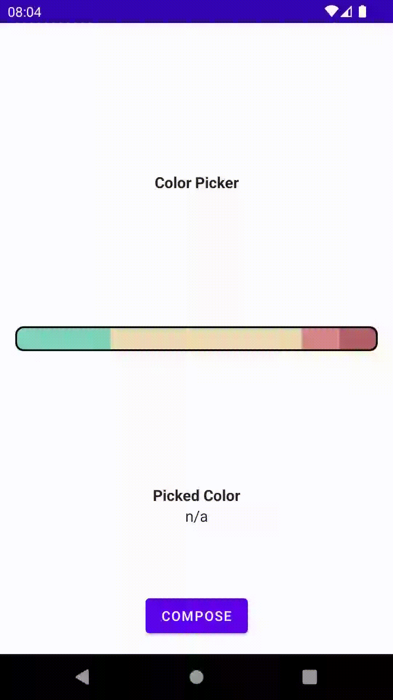
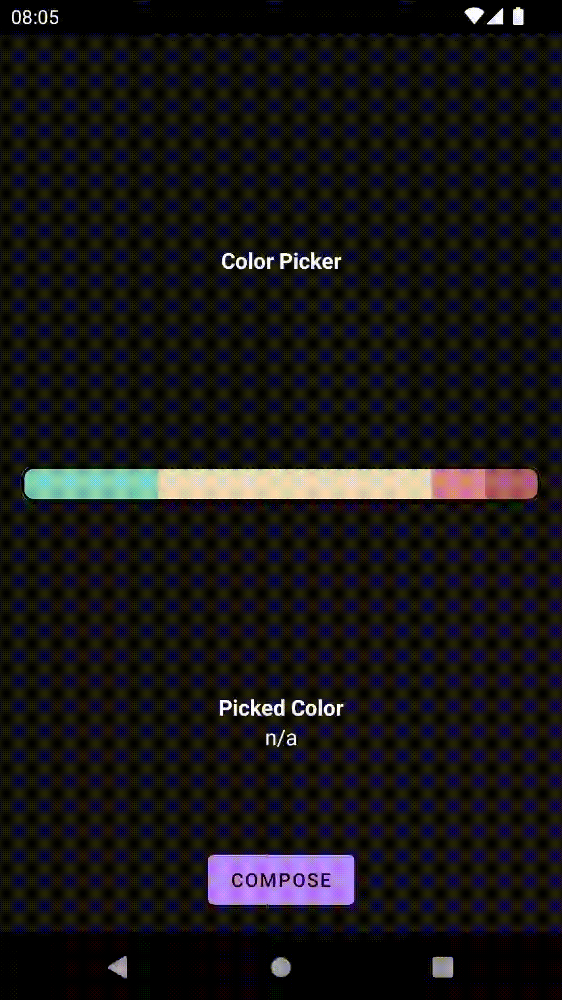

# Color Picker Widget

This widget is designed to display a horizontal list of colors of different widths, allowing users to interact with them and get information about the selected color.
It is implemented in two views View System and Jetpack Compose.

https://github.com/MATHEMA-GmbH/developer_interview/blob/main/code_projects/mobile/color_picker/color_slider.md

## Example
|  |  |
| --------------------------------------- | --------------------------------------- |